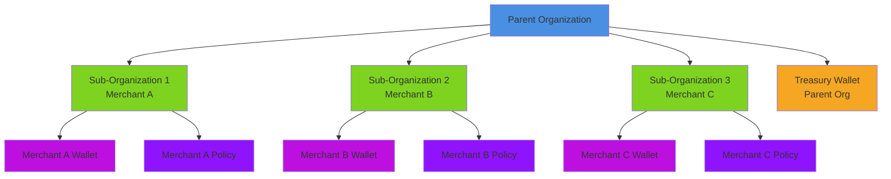
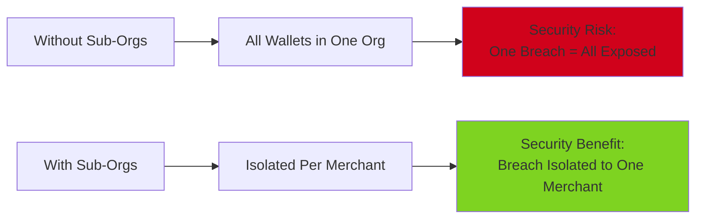
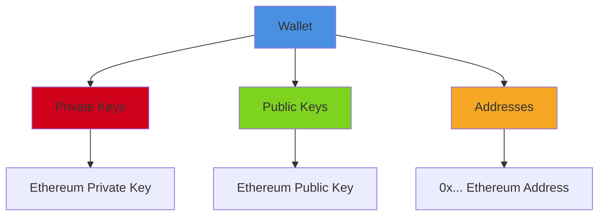
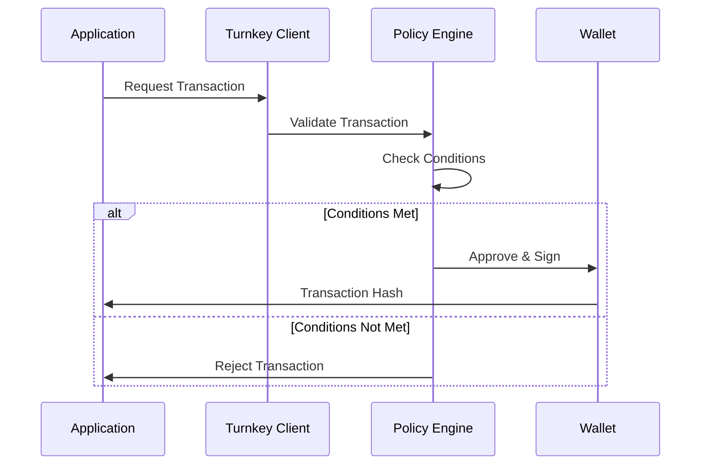
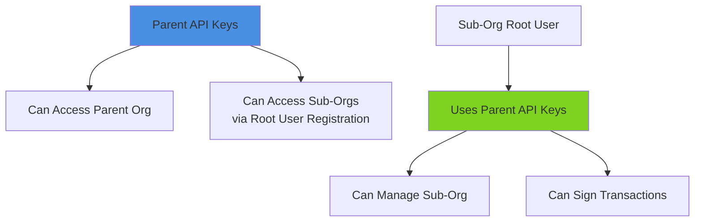
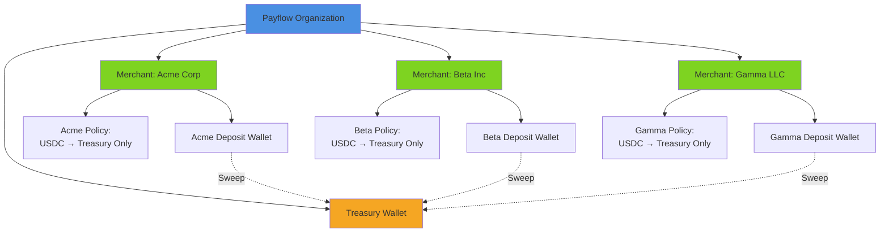

# Turnkey Hierarchy

Understanding the organizational structure in Turnkey is crucial for building secure, scalable applications. This guide explains how organizations, sub-organizations, wallets, and policies fit together.

## Overview

Turnkey uses a hierarchical structure that enables:
- **Isolation**: Separate security contexts for different entities
- **Scalability**: Manage thousands of merchants efficiently
- **Access Control**: Granular permissions at each level
- **Policy Enforcement**: Rules that apply to specific scopes

## Hierarchy Structure



## Components

### 1. Parent Organization

The **parent organization** is your main Turnkey account. In the Payflow demo, this represents Payflow's organization.

**Characteristics:**
- Contains all sub-organizations
- Houses the treasury wallet
- Manages API credentials for sub-organization access
- Provides the root of trust

**In the Code:**
```typescript
// Parent organization client
const turnkeyClient = new TurnkeySDKServer({
  apiPublicKey: process.env.API_PUBLIC_KEY!,
  apiPrivateKey: process.env.API_PRIVATE_KEY!,
  defaultOrganizationId: process.env.ORGANIZATION_ID!, // Parent org ID
});
```

### 2. Sub-Organizations

**Sub-organizations** are isolated child organizations created under the parent. Each merchant gets their own sub-organization.

**Characteristics:**
- Complete isolation from other sub-orgs
- Independent wallet management
- Scoped policy enforcement
- Can have their own users and authentication

**Why Sub-Organizations?**



**Benefits:**
1. **Security Isolation**: A compromise in one merchant's sub-org doesn't affect others
2. **Access Control**: Each merchant can have independent user management
3. **Policy Scoping**: Policies apply only to their sub-organization
4. **Scalability**: Easy to add/remove merchants without affecting others

**In the Code:**
```typescript
// Creating a sub-organization
const subOrgResponse = await turnkeyClient.apiClient().createSubOrganization({
  subOrganizationName: merchantName,
  rootUsers: [/* ... */],
  wallet: {
    walletName: `${merchantName} Wallet`,
    accounts: DEFAULT_ETHEREUM_ACCOUNTS,
  },
});
```

### 3. Wallets

**Wallets** are cryptographic key containers that generate and manage blockchain addresses.

**Types in Payflow Demo:**

#### Treasury Wallet
- Lives in the **parent organization**
- Receives all swept USDC funds
- Single omnibus wallet for all merchants

#### Merchant Wallets
- Live in **merchant sub-organizations**
- Receive customer deposits
- Subject to restrictive policies

**Wallet Structure:**



### 4. Policies

**Policies** are rules that restrict what transactions can be executed from wallets.

**Key Properties:**
- Policies are **scoped to sub-organizations**
- They enforce restrictions at the **infrastructure level**
- They use a **declarative language** to express conditions
- They can parse **transaction calldata** to validate transfers

**Policy Flow:**



## Access Control Flow

Understanding how API keys work across the hierarchy:



**Important**: In the Payflow demo, sub-organizations are created with the parent's API keys registered as root users. This allows the parent organization to manage sub-orgs while maintaining isolation.

## Real-World Example: Payflow

Here's how the hierarchy maps to Payflow's business model:



## Client Configuration

When working with different levels of the hierarchy, you need different client configurations:

### Parent Organization Client

```typescript
// For parent org operations (treasury, creating sub-orgs)
const parentClient = new TurnkeySDKServer({
  apiPublicKey: process.env.API_PUBLIC_KEY!,
  apiPrivateKey: process.env.API_PRIVATE_KEY!,
  defaultOrganizationId: process.env.ORGANIZATION_ID!, // Parent org
});
```

### Sub-Organization Client

```typescript
// For sub-org operations (signing transactions, creating policies)
const subOrgClient = new TurnkeySDKServer({
  apiPublicKey: process.env.API_PUBLIC_KEY!, // Same keys
  apiPrivateKey: process.env.API_PRIVATE_KEY!, // Same keys
  defaultOrganizationId: merchantSubOrgId, // Sub-org ID
});
```

**Critical**: When signing transactions from a sub-organization wallet, you **must** use a client configured with the sub-organization ID. Otherwise, Turnkey won't be able to resolve the wallet correctly.

## Best Practices

1. **Always use sub-organizations for multi-tenant scenarios**
   - Provides security isolation
   - Enables independent policy management

2. **Store sub-organization IDs in your database**
   - Don't rely on names (they can change)
   - Use IDs for all API calls

3. **Use the correct client for each operation**
   - Parent client for parent org operations
   - Sub-org client for sub-org operations

4. **Leverage policy scoping**
   - Policies in sub-orgs only affect that sub-org
   - Parent org policies don't affect sub-orgs

## Next Steps

- Learn how to create and manage [Sub-Organizations](03-sub-organizations.md)
- Understand how [Policies](04-policies.md) enforce restrictions
- See how [Fund Sweeping](05-fund-sweeping.md) works across the hierarchy

