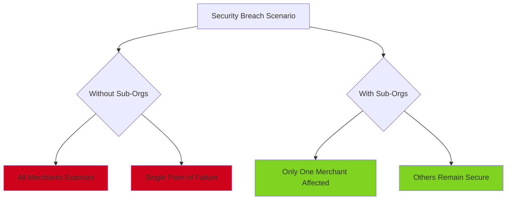
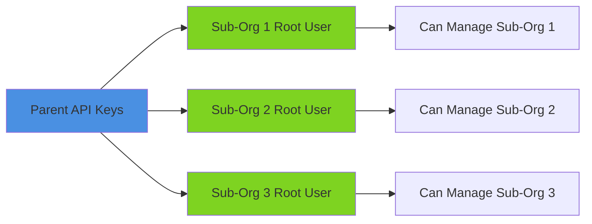
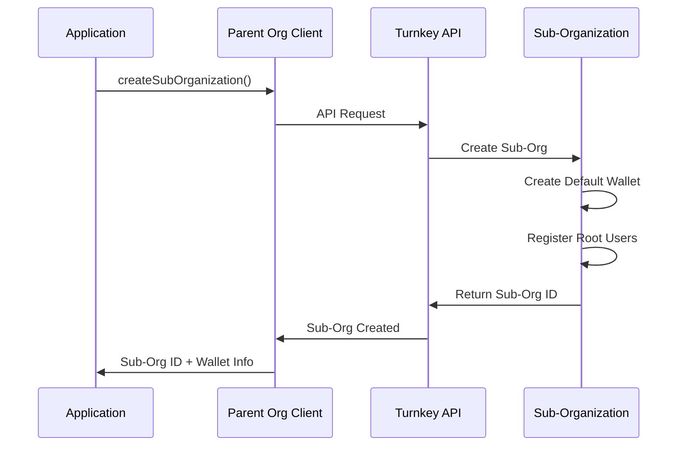
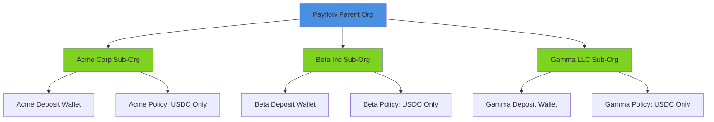

# Sub-Organizations

Sub-organizations are isolated child organizations that provide security boundaries and independent management for each merchant in the Payflow system.

## What Are Sub-Organizations?

A **sub-organization** is a complete, isolated organization created under a parent organization. Think of it as a separate account with its own:
- Wallets
- Policies
- Users and authentication
- Access controls

In the Payflow demo, each merchant gets their own sub-organization, ensuring complete isolation between merchants.

## Why Use Sub-Organizations?

### Security Isolation

The primary benefit is security isolation. If one merchant's sub-organization is compromised, other merchants remain unaffected.



### Independent Policy Management

Each sub-organization can have its own policies. This allows:
- Different rules per merchant (if needed)
- Policy changes that don't affect other merchants
- Merchant-specific security requirements

### Scalability

Sub-organizations make it easy to:
- Add new merchants without affecting existing ones
- Remove merchants without impacting others
- Scale to thousands of merchants

## Creating a Sub-Organization

In the Payflow demo, sub-organizations are created with the following structure:

```typescript
const subOrgResponse = await turnkeyClient.apiClient().createSubOrganization({
  subOrganizationName: merchantName,
  rootUsers: [
    {
      userName: "Merchant Root User",
      apiKeys: [
        {
          apiKeyName: `merchant-${merchantName}-api-key`,
          publicKey: parentApiPublicKey,
          curveType: "API_KEY_CURVE_SECP256K1",
        },
      ],
      authenticators: [],
      oauthProviders: [],
    },
  ],
  rootQuorumThreshold: 1,
  wallet: {
    walletName: `${merchantName} Wallet`,
    accounts: DEFAULT_ETHEREUM_ACCOUNTS,
  },
});
```

### Key Components

1. **Sub-Organization Name**: A human-readable identifier
2. **Root Users**: Initial users with administrative access
3. **Root Quorum Threshold**: Number of approvals needed (1 = single user)
4. **Wallet**: Optional default wallet created with the sub-org

### Root User Configuration

In the Payflow demo, the parent organization's API keys are registered as root users in each sub-organization. This allows:

- The parent to manage sub-organizations
- The parent to sign transactions on behalf of merchants
- Maintaining security isolation (sub-orgs can't access parent)



## Accessing Sub-Organizations

To perform operations on a sub-organization, you need a client configured with the sub-organization ID:

```typescript
// Create a client for the sub-organization
const subOrgClient = new TurnkeySDKServer({
  apiPublicKey: process.env.API_PUBLIC_KEY!,
  apiPrivateKey: process.env.API_PRIVATE_KEY!,
  defaultOrganizationId: merchantSubOrgId, // Sub-org ID, not parent
});
```

**Critical**: When signing transactions or creating policies in a sub-organization, you must use a client configured with the sub-organization ID. Using the parent organization ID will cause operations to fail.

## Sub-Organization Lifecycle

### Creation Flow



### Operations in Sub-Organizations

Once created, you can perform various operations:

1. **Create Wallets**: Additional wallets beyond the default
2. **Create Policies**: Transaction restrictions specific to the sub-org
3. **Sign Transactions**: Using wallets in the sub-org
4. **Manage Users**: Add/remove users (in production)

## Storage and Lookup

In production, you should:

1. **Store Sub-Organization IDs**: Don't rely on names (they can change)
2. **Map to Merchants**: Maintain a database mapping merchant IDs to sub-org IDs
3. **Cache for Performance**: Sub-org IDs don't change, so cache them

Example data structure:

```typescript
interface Merchant {
  merchantId: string;
  merchantName: string;
  subOrganizationId: string;
  walletId: string;
  walletAddress: string;
  createdAt: Date;
}
```

## Best Practices

### 1. One Sub-Organization Per Merchant

Each merchant should have exactly one sub-organization. This provides:
- Clear isolation boundaries
- Simplified management
- Predictable access patterns

### 2. Use Sub-Organization IDs, Not Names

Names can change, but IDs are permanent:

```typescript
// Good: Use ID
const client = getTurnkeyClientForSubOrg(merchant.subOrganizationId);

// Bad: Don't use name
const client = getTurnkeyClientForSubOrg(merchant.merchantName);
```

### 3. Configure Clients Correctly

Always use the right client for the right operation:

```typescript
// Parent operations (treasury, creating sub-orgs)
const parentClient = getTurnkeyClient();

// Sub-org operations (signing, policies)
const subOrgClient = getTurnkeyClientForSubOrg(subOrgId);
```

### 4. Handle Errors Gracefully

Sub-organization operations can fail. Handle errors appropriately:

```typescript
try {
  const merchant = await createMerchant(name);
  // Store merchant.subOrganizationId in database
} catch (error) {
  // Log error, retry, or notify admin
  console.error('Failed to create merchant:', error);
}
```

## Limitations and Considerations

### Quorum Thresholds

The demo uses `rootQuorumThreshold: 1`, meaning a single user can approve transactions. In production, consider:
- Multi-user quorums for high-value operations
- Different thresholds for different operations
- Time-based approvals for sensitive actions

### User Management

The demo creates minimal user setup. In production:
- Add proper authentication methods (passkeys, OAuth)
- Implement role-based access control
- Set up audit logging

### Policy Inheritance

Policies in sub-organizations do NOT inherit from the parent. Each sub-org needs its own policies.

## Real-World Example

Here's how Payflow uses sub-organizations:



When a new merchant signs up:
1. Payflow creates a sub-organization for them
2. A default wallet is created automatically
3. A restrictive policy is applied
4. The merchant can start receiving deposits

## Next Steps

- Understand how [Policies](04-policies.md) work within sub-organizations
- Learn about [Fund Sweeping](05-fund-sweeping.md) from sub-org wallets
- See the [Turnkey Hierarchy](02-turnkey-hierarchy.md) for the big picture

