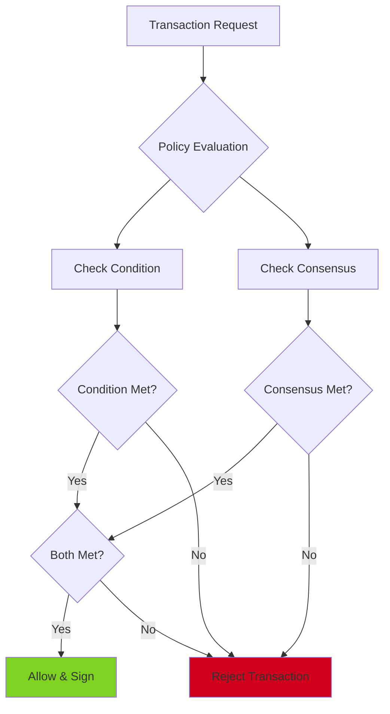
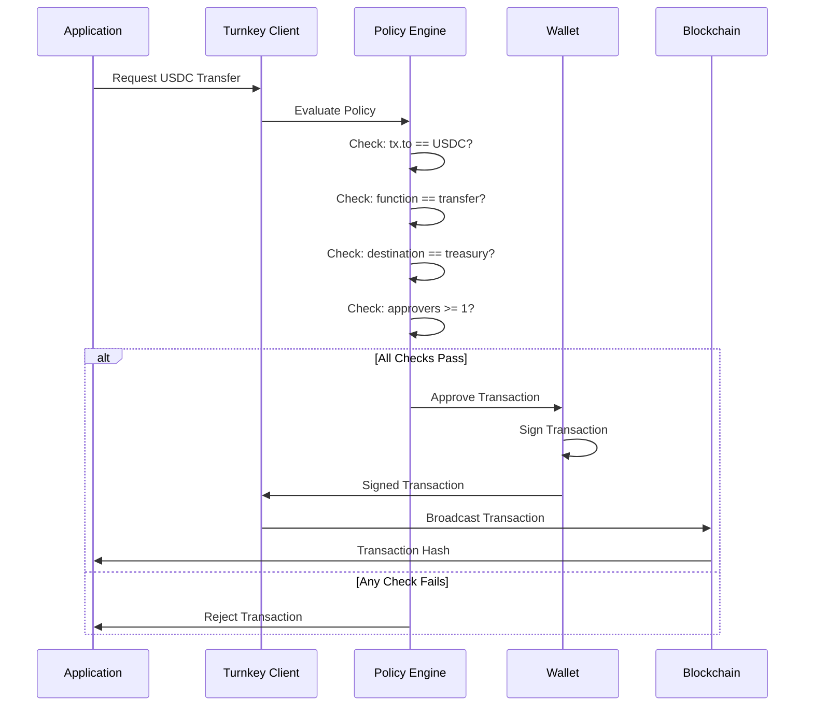
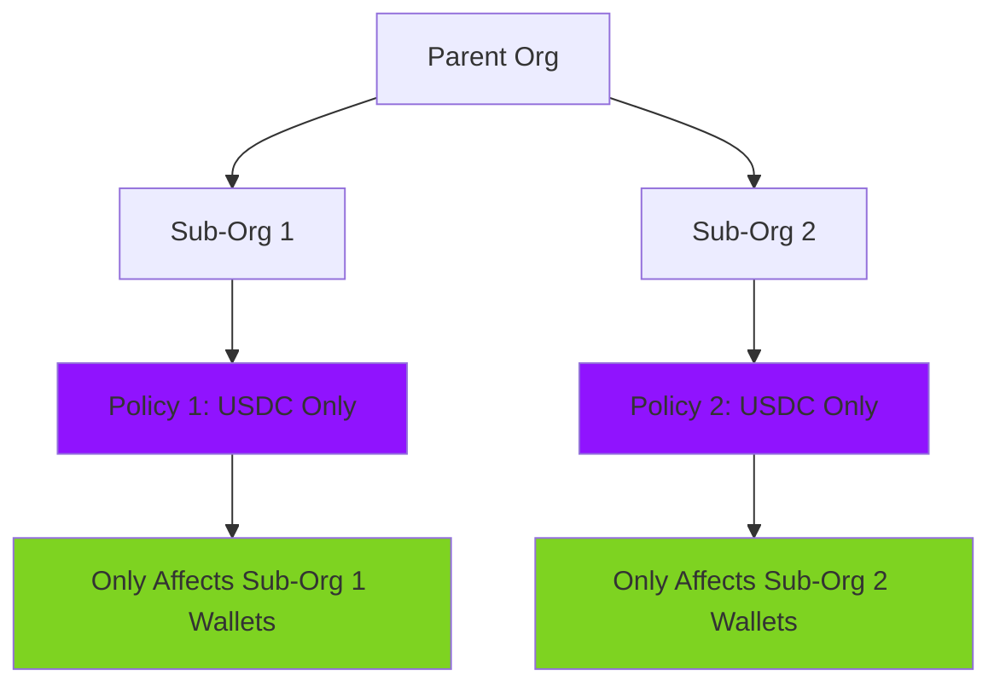

# Policies

Policies are rules that restrict what transactions can be executed from wallets. In the Payflow demo, policies ensure that merchant wallets can only transfer USDC to the treasury wallet.

## What Are Policies?

A **policy** is a declarative rule that Turnkey enforces at the infrastructure level. When a transaction is requested, Turnkey evaluates the policy before signing. If the policy conditions are met, the transaction proceeds. If not, it's rejected.

## Policy Structure

Policies consist of three main components:

1. **Condition**: Boolean expression that must evaluate to true
2. **Consensus**: Approval requirements (who must approve)
3. **Effect**: What happens when conditions are met (ALLOW or DENY)



## Payflow Policy: USDC-Only to Treasury

The Payflow demo creates a policy that enforces two restrictions:

1. **USDC-only**: Only transactions to the USDC token contract
2. **Treasury-only**: Transfers must go to the treasury wallet address

### Policy Condition

```typescript
const condition = [
  `eth.tx.to == '${usdcTokenAddress.toLowerCase()}'`, // Must be to USDC contract
  `eth.tx.data[2..10] == 'a9059cbb'`, // ERC-20 transfer function selector
  `eth.tx.data[10..74] == '${treasuryAddressPadded}'`, // Treasury address in calldata
].join(" && ");
```

### Breaking Down the Condition

#### 1. Transaction Destination

```typescript
eth.tx.to == '0x1c7d4b196cb0c7b01d743fbc6116a902379c7238'
```

This ensures the transaction is sent to the USDC token contract address, not any other contract or EOA.

#### 2. Function Selector

```typescript
eth.tx.data[2..10] == 'a9059cbb'
```

ERC-20 `transfer(address,uint256)` has function selector `0xa9059cbb`. This ensures we're calling the transfer function, not other functions like `approve` or `transferFrom`.

#### 3. Destination Address in Calldata

```typescript
eth.tx.data[10..74] == '0000000000000000000000001234567890abcdef...'
```

ERC-20 transfer calldata structure:
- Bytes 0-3: Function selector (`0xa9059cbb`)
- Bytes 4-35: Destination address (32 bytes, padded)
- Bytes 36-67: Amount (32 bytes)

The policy checks that the destination address in the calldata matches the treasury address.

### Policy Consensus

```typescript
const consensus = "approvers.count() >= 1";
```

This means at least one approver must approve the transaction. In the demo, this is the root user (parent API keys).

### Policy Effect

```typescript
effect: "EFFECT_ALLOW"
```

When conditions are met, the transaction is allowed and signed.

## Policy Execution Flow

Here's what happens when a sweep transaction is requested:



## Policy Scoping

Policies are scoped to sub-organizations. This means:

- A policy in Sub-Org A only affects wallets in Sub-Org A
- Policies in the parent organization don't affect sub-org wallets
- Each merchant can have different policies (if needed)



## Creating Policies

In the Payflow demo, policies are created in the merchant's sub-organization:

```typescript
const policyId = await turnkeyClient.apiClient().createPolicy({
  organizationId: subOrganizationId, // Must be sub-org ID
  policyName: `USDC-Only Policy for ${merchantAddress}`,
  condition: condition,
  consensus: consensus,
  effect: "EFFECT_ALLOW",
  notes: `USDC-only policy for merchant sub-org...`,
});
```

**Important**: The `organizationId` must be the sub-organization ID, not the parent. Policies created in the parent won't affect sub-org wallets.

## Policy Language

Turnkey's policy language supports:

- **Transaction fields**: `eth.tx.to`, `eth.tx.value`, `eth.tx.data`
- **String operations**: Equality, substring extraction
- **Calldata parsing**: Extract specific bytes from transaction data
- **Approver checks**: `approvers.count()`, `approvers.contains(userId)`

### Calldata Parsing

The policy language uses slice notation to extract bytes:

```typescript
eth.tx.data[2..10]  // Bytes 2-10 (function selector)
eth.tx.data[10..74] // Bytes 10-74 (destination address, 32 bytes)
```

Note: The `0x` prefix is at positions 0-1, so actual data starts at position 2.

## Threshold Enforcement

The sweep threshold (minimum USDC amount) is enforced at the **application level**, not the policy level. This is because:

1. Turnkey's policy language doesn't support parsing hex strings to numbers
2. Threshold checks require comparing the amount value in calldata
3. Application-level checks are more flexible

```typescript
// Application-level threshold check (in sweepUSDC.ts)
const sweepThresholdUSDC = parseFloat(process.env.SWEEP_THRESHOLD_USDC || "0.03");
const thresholdRaw = fromReadableAmount(sweepThresholdUSDC.toString(), USDC_DECIMALS);

if (balance < thresholdRaw) {
  return { success: false, error: "Balance below threshold" };
}
```

The policy enforces **what** can be transferred (USDC to treasury), while the application enforces **when** transfers happen (above threshold).

## Policy Limitations

### What Policies Can't Do

1. **Parse amounts from calldata**: Can't compare transfer amounts
2. **Time-based conditions**: Can't enforce time windows
3. **Complex business logic**: Limited to declarative conditions
4. **External data**: Can't query external APIs or contracts

### Workarounds

For limitations, use application-level checks:
- Amount thresholds: Check in application code
- Time windows: Enforce in application logic
- Complex rules: Combine policies with application logic

## Testing Policies

To test that policies work:

1. **Try a valid transaction**: Should succeed
   - USDC transfer to treasury
   - Meets all policy conditions

2. **Try an invalid transaction**: Should fail
   - Transfer to wrong address
   - Transfer of wrong token
   - Wrong function call

The policy will reject invalid transactions before they're signed.

## Production Considerations

### Enhanced Policy Conditions

In production, you might want to:
- Add additional validation checks
- Support multiple treasury addresses
- Handle edge cases (zero amounts, etc.)

### Policy Updates

Policies can be updated, but consider:
- Impact on in-flight transactions
- Testing policy changes
- Versioning policies for audit trails

### Monitoring

Monitor policy rejections to:
- Detect attempted unauthorized transactions
- Identify policy misconfigurations
- Track security events

## Next Steps

- See how policies are used in [Fund Sweeping](05-fund-sweeping.md)
- Understand the [Turnkey Hierarchy](02-turnkey-hierarchy.md) for policy scoping
- Learn about [Sub-Organizations](03-sub-organizations.md) where policies live

