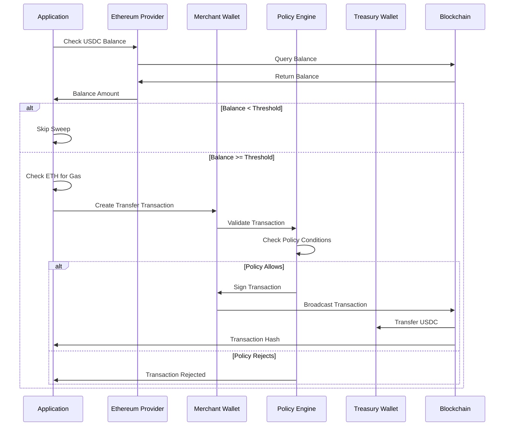

# Fund Sweeping

Fund sweeping is the automated process of transferring USDC from merchant deposit wallets to the central treasury wallet. This guide explains how the sweeping mechanism works in the Payflow demo.

## Overview

The fund sweeping process:
1. Checks merchant wallet USDC balance
2. Validates the balance meets the threshold
3. Transfers all USDC to the treasury wallet
4. Handles gas fees and transaction confirmation

## Sweep Flow



## Key Components

### 1. Balance Check

Before sweeping, the system checks the merchant wallet's USDC balance:

```typescript
const usdcContract = new ethers.Contract(usdcTokenAddress, ERC20_ABI, signer);
const balance = await usdcContract.balanceOf(merchantAddress);
```

### 2. Threshold Enforcement

The sweep only proceeds if the balance meets the minimum threshold:

```typescript
const sweepThresholdUSDC = parseFloat(process.env.SWEEP_THRESHOLD_USDC || "0.03");
const thresholdRaw = fromReadableAmount(sweepThresholdUSDC.toString(), USDC_DECIMALS);

if (balance < thresholdRaw) {
  return { success: false, error: "Balance below threshold" };
}
```

**Why a threshold?**
- Reduces transaction costs (gas fees)
- Batches smaller deposits
- Configurable per business needs

### 3. Gas Fee Management

**Important**: The merchant wallet pays for gas fees, not the treasury. This is because:
- The merchant wallet is signing the transaction
- The transaction originates from the merchant wallet
- ETH must be available in the merchant wallet

```typescript
const merchantEthBalance = await provider.getBalance(merchantAddress);
if (merchantEthBalance < ethers.parseEther("0.001")) {
  return { success: false, error: "Insufficient ETH for gas fees" };
}
```

### 4. Transaction Creation

The sweep creates an ERC-20 transfer transaction:

```typescript
const transferTx = await usdcContract.transfer(treasuryAddress, balance);
```

This calls the USDC token contract's `transfer` function with:
- `to`: Treasury wallet address
- `amount`: Full merchant wallet balance

### 5. Policy Validation

Before signing, Turnkey's policy engine validates the transaction:
- Is it to the USDC contract? (Yes)
- Is it the transfer function? (Yes)
- Is the destination the treasury? (Yes)

If all checks pass, the transaction is signed and broadcast.

### 6. Confirmation

The system waits for transaction confirmation:

```typescript
const receipt = await provider.waitForTransaction(transferTx.hash, 1);
```

## Client Configuration

**Critical**: When sweeping from a merchant wallet, you must use a client configured with the merchant's sub-organization ID:

```typescript
// Correct: Sub-org client
const subOrgClient = getTurnkeyClientForSubOrg(merchantSubOrgId);
const signer = getTurnkeySigner(provider, merchantSubOrgId, merchantAddress, subOrgClient);

// Wrong: Parent org client (won't work)
const parentClient = getTurnkeyClient();
const signer = getTurnkeySigner(provider, parentOrgId, merchantAddress, parentClient);
```

Using the wrong client will cause the transaction to fail because Turnkey can't resolve the wallet in the correct organization context.

## Sweep Process Details

### Step-by-Step Execution

1. **Initialize Provider**: Connect to Ethereum network (Sepolia/Goerli)
2. **Get Sub-Org Client**: Create Turnkey client for merchant's sub-organization
3. **Resolve Signing Identifier**: Get the correct wallet identifier (address or private key ID)
4. **Check ETH Balance**: Ensure merchant wallet has ETH for gas
5. **Check USDC Balance**: Query current USDC balance
6. **Validate Threshold**: Ensure balance meets minimum requirement
7. **Create Transfer**: Build ERC-20 transfer transaction
8. **Policy Validation**: Turnkey validates against policy
9. **Sign & Broadcast**: Transaction is signed and sent to network
10. **Wait for Confirmation**: Monitor for transaction inclusion
11. **Return Result**: Success or error with details

### Error Handling

The sweep process handles various error conditions:

```typescript
// No balance
if (balance === 0n) {
  return { success: false, error: "No USDC balance to sweep" };
}

// Below threshold
if (balance < thresholdRaw) {
  return { success: false, error: "Balance below threshold" };
}

// Insufficient ETH
if (merchantEthBalance < ethers.parseEther("0.001")) {
  return { success: false, error: "Insufficient ETH for gas fees" };
}

// Transaction failure
if (receipt.status !== 1) {
  return { success: false, error: "Transaction failed" };
}
```

## Sweep Triggers

In the Payflow demo, sweeps can be triggered:

1. **Manually**: Via CLI "Sweep Funds" command
2. **During Full Demo**: As part of the complete flow
3. **Programmatically**: From application code

### Manual Sweep

```bash
# In CLI menu
6. Sweep Funds to Treasury
```

### Programmatic Sweep

```typescript
const result = await sweepUSDC(
  merchantAddress,
  merchantSubOrgId,
  merchantWalletId,
  treasuryAddress,
  usdcTokenAddress,
  network
);

if (result.success) {
  console.log(`Swept ${result.amount} USDC`);
  console.log(`Transaction: ${result.transactionHash}`);
} else {
  console.error(`Sweep failed: ${result.error}`);
}
```

## Automation Considerations

For production, consider automating sweeps:

### Polling-Based

```typescript
// Check balances periodically
setInterval(async () => {
  for (const merchant of merchants) {
    const result = await sweepUSDC(/* ... */);
    // Handle result
  }
}, 5 * 60 * 1000); // Every 5 minutes
```

### Event-Based

```typescript
// Listen for USDC deposits
usdcContract.on("Transfer", async (from, to, amount) => {
  if (to === merchantAddress) {
    // Trigger sweep after deposit
    await sweepUSDC(/* ... */);
  }
});
```

### Webhook-Based

Set up Turnkey webhooks to detect when balances change, then trigger sweeps.

## Gas Optimization

### Batch Sweeping

Instead of sweeping each merchant individually, batch multiple sweeps:

```typescript
// Sweep multiple merchants in parallel
const sweepPromises = merchants.map(merchant =>
  sweepUSDC(/* merchant params */)
);
const results = await Promise.allSettled(sweepPromises);
```

### Gas Price Optimization

Monitor gas prices and sweep during low-fee periods:

```typescript
const feeData = await provider.getFeeData();
if (feeData.gasPrice < threshold) {
  // Gas is cheap, proceed with sweep
}
```

## Testing Sweeps

### 1. Get Testnet USDC

Visit [Circle's USDC Faucet](https://faucet.circle.com/) and request testnet USDC.

### 2. Send to Merchant Wallet

Transfer USDC to the merchant wallet address (at least the threshold amount).

### 3. Ensure ETH for Gas

Send testnet ETH to the merchant wallet for gas fees.

### 4. Run Sweep

Execute the sweep command and verify the transaction on Etherscan.

## Production Considerations

### Monitoring

Track sweep operations:
- Success/failure rates
- Gas costs
- Transaction times
- Error patterns

### Retry Logic

Implement retry logic for transient failures:

```typescript
async function sweepWithRetry(/* params */, maxRetries = 3) {
  for (let i = 0; i < maxRetries; i++) {
    try {
      return await sweepUSDC(/* params */);
    } catch (error) {
      if (i === maxRetries - 1) throw error;
      await sleep(1000 * (i + 1)); // Exponential backoff
    }
  }
}
```

### Rate Limiting

Avoid overwhelming the network or Turnkey API:
- Limit concurrent sweeps
- Add delays between sweeps
- Respect API rate limits

### Audit Logging

Log all sweep operations:
- Merchant ID
- Amount swept
- Transaction hash
- Timestamp
- Success/failure

## Common Issues

### Insufficient ETH for Gas

**Problem**: Merchant wallet doesn't have ETH to pay gas fees.

**Solution**: 
- Fund merchant wallet with ETH
- Consider a gas reimbursement mechanism
- Use a gas relay service

### Policy Rejection

**Problem**: Transaction is rejected by policy.

**Solution**:
- Verify policy conditions are correct
- Check that destination is treasury address
- Ensure USDC contract address is correct

### Balance Below Threshold

**Problem**: Balance exists but is below threshold.

**Solution**:
- Lower threshold (if business allows)
- Wait for more deposits
- Manually override threshold for specific cases

## Next Steps

- Understand how [Policies](04-policies.md) validate sweep transactions
- Learn about [Sub-Organizations](03-sub-organizations.md) where merchant wallets live
- Explore the [CLI Interface](06-cli-usage.md) for manual sweeps

