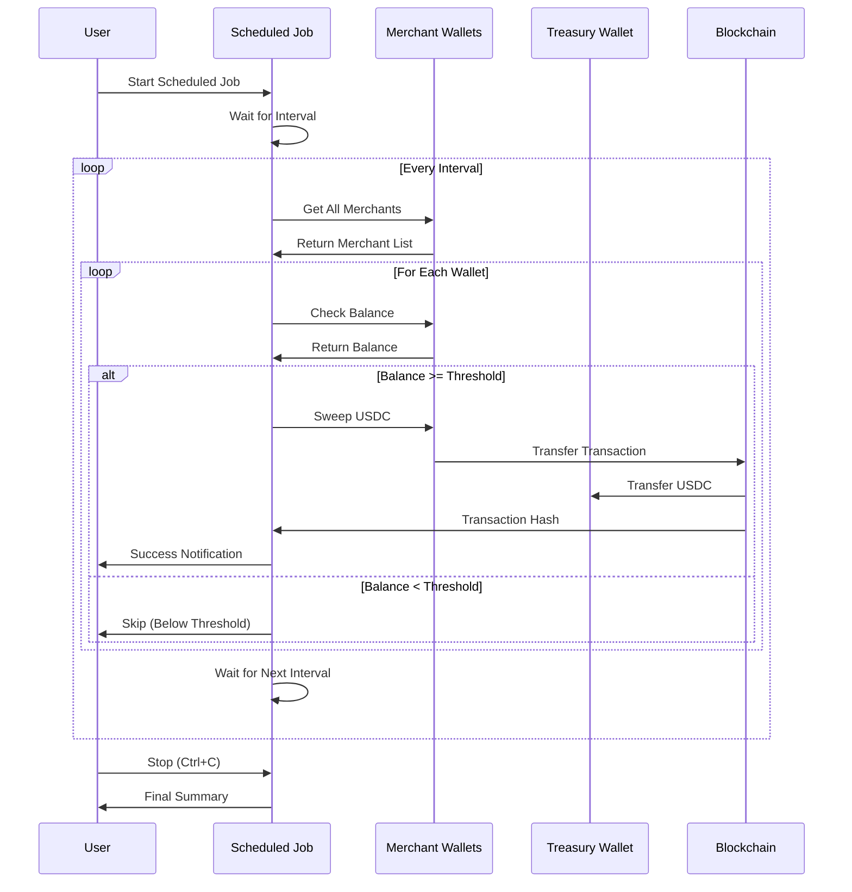

# Scheduled Sweep Jobs

The scheduled sweep job feature allows you to run automated fund sweeping at regular intervals. This is useful for production environments where you need continuous fund collection from merchant wallets.

## Overview

A scheduled sweep job:
- Runs continuously at a configurable interval
- Automatically sweeps all merchant wallets
- Provides real-time feedback on each sweep iteration
- Tracks cumulative statistics
- Can be stopped gracefully with Ctrl+C

## When to Use Scheduled Sweeps

**Use scheduled sweeps when:**
- You need continuous fund collection
- You want to automate the sweep process
- You're running the demo in a production-like environment
- You want to monitor fund collection over time

**Use one-time sweeps when:**
- You're testing the sweep functionality
- You want immediate results
- You need to sweep on-demand

## Starting a Scheduled Sweep Job

### From the CLI Menu

1. Select **"7. Scheduled Sweep Job"** from the main menu
2. Choose your sweep interval:
   - **1 minute**: For high-frequency monitoring
   - **5 minutes**: Balanced frequency
   - **30 minutes**: Lower frequency, less resource usage
   - **Custom**: Enter any interval in minutes (minimum 0.1 minutes)

3. Review the configuration
4. Confirm to start the job

### Configuration

The job will display:
- Sweep interval
- Network configuration
- Treasury wallet address
- Sweep threshold

## How It Works



## Job Execution Flow

### Initialization

1. **Setup Treasury**: Gets or creates the treasury wallet
2. **Load Configuration**: Reads network, threshold, and other settings
3. **Display Configuration**: Shows job parameters for confirmation

### Main Loop

For each interval:

1. **Fetch Merchants**: Gets all merchants and their wallets
2. **Iterate Wallets**: Processes each wallet sequentially
3. **Check Balance**: Verifies USDC balance meets threshold
4. **Sweep Funds**: Transfers USDC if balance is sufficient
5. **Log Results**: Displays success/failure for each wallet
6. **Wait Interval**: Pauses until next sweep cycle

### Output Format

Each iteration shows:

```
============================================================
Sweep Iteration #1 - 12/15/2024, 3:45:23 PM
============================================================

Checking 5 wallet(s) across 3 merchant(s)

  ✓ Acme Corp - Acme Corp Wallet: 0.500000 USDC
    https://sepolia.etherscan.io/tx/0x1234...

  ✓ Beta Inc - Beta Inc Wallet: 1.200000 USDC
    https://sepolia.etherscan.io/tx/0x5678...

Iteration #1 Summary: 2 successful sweep(s), 1.700000 USDC

Next sweep in 5 minute(s)...
```

## Interval Selection

### Predefined Intervals

- **1 minute**: Fast monitoring, good for testing
  - High resource usage
  - Quick feedback
  - Useful for development

- **5 minutes**: Balanced option
  - Moderate resource usage
  - Good for most use cases
  - Recommended for production

- **30 minutes**: Lower frequency
  - Minimal resource usage
  - Good for low-volume scenarios
  - Reduces API calls

### Custom Intervals

You can specify any interval in minutes:
- Minimum: 0.1 minutes (6 seconds)
- Maximum: No limit (but practical limits apply)
- Examples: 0.5 (30 seconds), 15 (15 minutes), 60 (1 hour)

**Note**: Very short intervals (< 1 minute) may cause:
- High API usage
- Increased gas costs
- Rate limiting issues

## Monitoring and Statistics

### Per-Iteration Statistics

Each sweep iteration shows:
- Number of wallets checked
- Successful sweeps with amounts
- Transaction hashes
- Errors or skipped wallets

### Cumulative Statistics

When the job stops (Ctrl+C), you'll see:
- Total iterations run
- Total successful sweeps
- Total USDC swept
- Total skipped/failed attempts

## Stopping the Job

### Graceful Shutdown

Press **Ctrl+C** to stop the job gracefully. The job will:
1. Complete the current sweep iteration
2. Display final statistics
3. Exit cleanly

### What Happens on Stop

```
============================================================
Scheduled Sweep Job Summary
============================================================
Total Iterations: 12
Successful Sweeps: 8
Skipped/Failed: 4
Total USDC Swept: 5.250000 USDC
============================================================

Scheduled sweep job stopped
```

## Best Practices

### Interval Selection

- **Development/Testing**: Use 1-5 minute intervals
- **Production**: Use 5-30 minute intervals
- **High Volume**: Consider shorter intervals (1-5 minutes)
- **Low Volume**: Use longer intervals (15-30 minutes)

### Resource Management

- Monitor API rate limits
- Consider gas costs for frequent sweeps
- Balance interval with operational needs

### Error Handling

The job continues running even if:
- Individual sweeps fail
- Network errors occur
- Some wallets are unavailable

Errors are logged but don't stop the job.

## Production Considerations

### Running as a Service

For production, consider:
- Running as a systemd service (Linux)
- Using PM2 or similar process manager
- Setting up proper logging
- Monitoring job health

### Example: PM2 Configuration

```json
{
  "name": "payflow-scheduled-sweep",
  "script": "src/commands/scheduledSweep.ts",
  "interpreter": "tsx",
  "autorestart": true,
  "watch": false,
  "max_memory_restart": "1G"
}
```

### Monitoring

Set up monitoring for:
- Job uptime
- Sweep success rates
- Total funds collected
- Error rates

### Logging

Consider redirecting output to log files:
```bash
pnpm demo > sweep-job.log 2>&1
```

## Troubleshooting

### Job Stops Unexpectedly

**Problem**: Job exits without Ctrl+C

**Solutions**:
- Check for unhandled errors
- Verify network connectivity
- Check API rate limits
- Review error logs

### No Sweeps Happening

**Problem**: Job runs but no funds are swept

**Possible Causes**:
- Merchant wallets have no USDC
- Balances below threshold
- Insufficient ETH for gas
- Policy restrictions

**Solutions**:
- Check wallet balances
- Verify threshold setting
- Ensure wallets have ETH
- Review policy configuration

### High Resource Usage

**Problem**: Job consumes too many resources

**Solutions**:
- Increase interval duration
- Reduce number of merchants
- Optimize sweep logic
- Use batch processing

## Comparison: One-Time vs Scheduled Sweeps

| Feature | One-Time Sweep | Scheduled Sweep |
|---------|---------------|-----------------|
| Execution | Single run | Continuous |
| Interval | N/A | Configurable |
| Use Case | Testing, on-demand | Production automation |
| Monitoring | Immediate results | Ongoing statistics |
| Resource Usage | Low | Varies by interval |
| Best For | Development | Production |

## Next Steps

- Learn about [Fund Sweeping](05-fund-sweeping.md) mechanics
- Understand [Policies](04-policies.md) that govern sweeps
- Review [CLI Usage](06-cli-usage.md) for other commands

